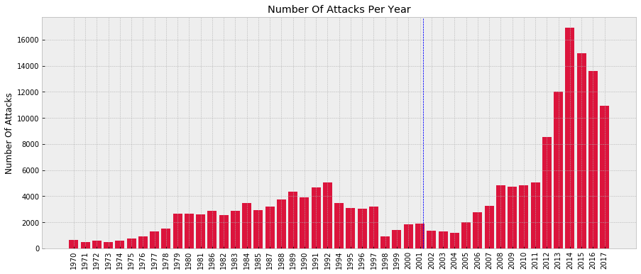
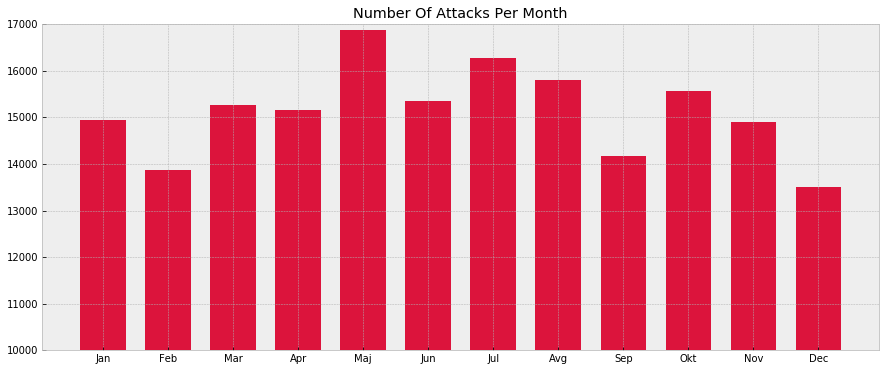
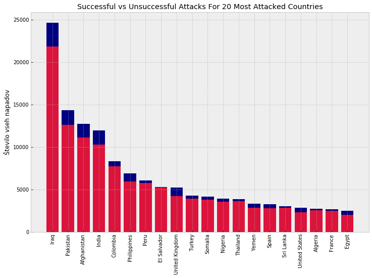
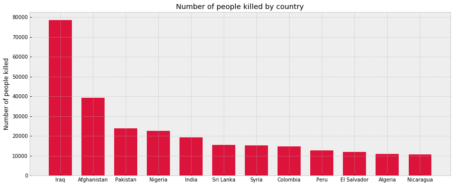
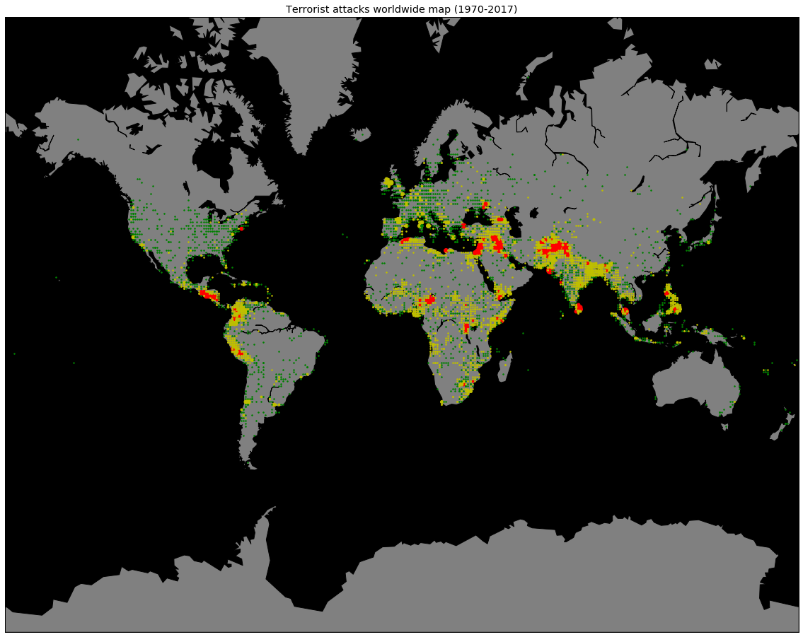

# PR19TMAPNTM
Project work for Data Mining course at University of Ljubljana - 2019

## Avtorji
- Nik Turk
- Andrej Pavlovčič
- Miha Štravs
- Tobias Mihelčič

# Izbor podatkovne množice
Za projektno nalogo pri Podatkovnem Rudarjenju FRI Ljubljana smo si izbrali pridobivanje podatkov iz množice terorističnih napadov.
Naša množica vsebuje več kot 180.000 podatkov o napadih med leti 1970 in 2017.

## Oblika podatkov
Zbirka podatkov iz Kaggla, ki jo bomo uporabili vsebuje 180.000 vrstic podatkov. Vsaka vrstica ima 150 stolpcev. 
Večina stolpcev nima večje uporabnosti, zato smo že pred uporabo množice zožali nabor stolpcev na najbolj pomembnih 25.
Ravno tako je bilo potrebno v podatkih nadomestiti znake '#', '-', in ',' saj motijo funkcijo loadtxt. Ločilo med podatki pa je znak '|'.

Pomembnejši stolpci (ne pa tudi vsi, ki smi jih prenesli): 
 * datum napada (predvsem mesec in leto)
 * država napada
 * zemljepisna globina in širina
 * število ubitih in ranjenih ljudi
 * denarna škoda v USD

## Naša vprašanja oz. primeri uporabe zbirke podatkov

- Katere države so najbolj podrejene terorističnim napadom?
- V katerih letih se je zgodilo največ napadov? Oziroma njegov trend.
- Delež uspešnih in neuspešnih napadov
- Število napadov po mesecih
- Predstavitev pogostosti napadov po zemljevidu

# Inicializacija podatkov

Začnimo najprej z inicializacijo podatkov in branjem iz .csv datoteke. Za lažje delo in manipulacijo podatkov si bomo pomagali z knjižnicami **pandas** in **numpy** za delo z podatki ter **seaborn** in **matplotlib** za vizualizacijo podatkov. V prihodnje bomo za gradnjo modelov in evaluacijo klasifikacijske točnosti ter ostalo validacijo uporabili še popularno knjižnico **scikit-learn**.

    
	from datetime import datetime
	from csv import DictReader
	import numpy as np
	import matplotlib.pyplot as plt
	from mpl_toolkits.basemap import Basemap
	plt.style.use('bmh')

    terrorism = np.loadtxt('TerroristAttacks.csv', dtype='str', delimiter="|", skiprows = 2, encoding="ISO-8859-1")
	Preberemo naših 25 izbranih stolpcev. Tako imamo omejen izbor podatkov, s katerim pa še vedno lahko imamo ogromno kombinacij.
	
	

## Pregled osnovnih podatkov in relevantnosti

Najprej si oglejmo število napadov po letih. Ugotovimo, da je bilo število napadov pred letom 2001 (to je pred napadom 11. septembra 2001) sorazmerno nizko.
Nato pa se je število napadov močno povečalo (sicer ne takoj, ampak rezultati vojne proti terorizmu s strani ZDA so vidni)
	
	
	
Ta graf ne prikazuje nobenih trendov. Prikazuje ravno nasprotno od pričakovanega, saj je decembra najmanj napadov 
(takrat bi pričakoval da teroristi največkrat sejejo teror, ker je takrat ljudi najlažje ustrahovati).
Število napadov po mesecih.
	
	
	
Ta graf predstavlja število uspešnih in število neuspešnih napadov za 20 najbolj pogosto napadenih držav.
Kot lahko opazimo je Irak daleč pred vsemi po številu napadov. Več kot 90% napadov je uspešnih.
	

Ugotovimo, da je število mrtvih največje prav v Iraku, in to ponovno za kar veliko razliko. To lahko pripišemu temu, da je Irak tudi najbolj terorizirana država na svetu.
	

	
Na tem grafu, je večje število napadov na določenem območju predstavljeno z večjim krogom. 3 različne barve pa pomenijo število žrtev v napadih (zelena, rumena, rdeča).
Opazimo kar nekaj kriznih območij. Še posebej na območju srednjega vzhoda.
	

## Glavne začetne ugotovitve

Zanimivo je predvsem to, da je Evropa kar se tiče smrtnih žrtev in napadov na sploh zelo varna celina. 
Potrebno bo ugotoviti kakšen je trend terorističnih napadov po letih na posameznih kontinentih.

